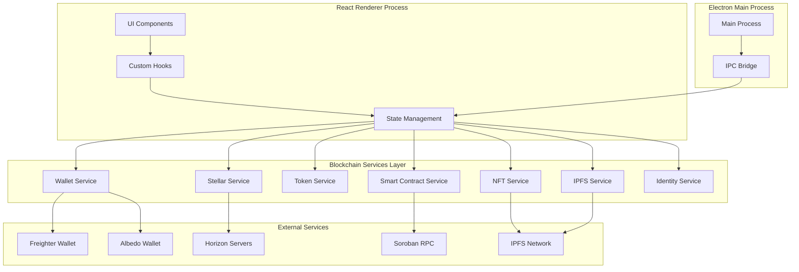

# Design Document: Stellar Web3 Integration

## Overview

This design document outlines the architecture and implementation strategy for integrating Web3 and Stellar blockchain capabilities into SocialFlow, an Electron-based social media management desktop application. The integration will transform SocialFlow into a decentralized platform where users authenticate via blockchain wallets, manage tokenized incentives, process cryptocurrency payments, deploy smart contracts for campaigns, mint NFTs, and leverage decentralized storage.

The design follows a modular architecture that separates blockchain concerns from existing social media management features, ensuring maintainability and allowing independent development of Web3 components.

### Key Design Principles

1. **Separation of Concerns**: Blockchain logic isolated in dedicated services
2. **Security First**: Private keys never stored or transmitted; all signing delegated to wallet providers
3. **Progressive Enhancement**: Existing features remain functional; Web3 features are additive
4. **User Experience**: Complex blockchain operations abstracted behind intuitive UI
5. **Testability**: All components designed for comprehensive unit and property-based testing
6. **Performance**: Efficient caching, connection pooling, and async operations
7. **Extensibility**: Plugin architecture for adding new wallet providers and blockchain features

## Architecture

### High-Level Architecture



### Directory Structure

```
src/
├── blockchain/
│   ├── services/
│   │   ├── WalletService.ts          # Wallet connection and management
│   │   ├── StellarService.ts         # Core Stellar SDK operations
│   │   ├── TokenService.ts           # Token creation and management
│   │   ├── NFTService.ts             # NFT minting and transfers
│   │   ├── SmartContractService.ts   # Soroban contract interactions
│   │   ├── PaymentService.ts         # Payment processing
│   │   ├── IPFSService.ts            # Decentralized storage
│   │   ├── IdentityService.ts        # Decentralized identity
│   │   ├── AnalyticsService.ts       # On-chain analytics
│   │   └── EventMonitorService.ts    # Blockchain event monitoring
│   ├── types/
│   │   ├── wallet.ts                 # Wallet-related types
│   │   ├── transaction.ts            # Transaction types
│   │   ├── token.ts                  # Token types
│   │   ├── nft.ts                    # NFT types
│   │   └── contract.ts               # Smart contract types
│   ├── hooks/
│   │   ├── useWallet.ts              # Wallet connection hook
│   │   ├── useBalance.ts             # Balance tracking hook
│   │   ├── useTransaction.ts         # Transaction submission hook
│   │   ├── useTokens.ts              # Token management hook
│   │   └── useNFTs.ts                # NFT operations hook
│   ├── utils/
│   │   ├── stellar.ts                # Stellar helper functions
│   │   ├── validation.ts             # Input validation
│   │   ├── formatting.ts             # Display formatting
│   │   └── errors.ts                 # Error handling utilities
│   └── config/
│       ├── networks.ts               # Network configurations
│       └── constants.ts              # Blockchain constants
├── components/
│   ├── blockchain/
│   │   ├── WalletConnect.tsx         # Wallet connection UI
│   │   ├── WalletInfo.tsx            # Wallet details display
│   │   ├── TransactionHistory.tsx    # Transaction list
│   │   ├── TokenManager.tsx          # Token creation/management
│   │   ├── NFTGallery.tsx            # NFT display
│   │   ├── NFTMinter.tsx             # NFT creation UI
│   │   ├── CampaignManager.tsx       # Smart contract campaigns
│   │   ├── PaymentModal.tsx          # Payment interface
│   │   ├── GasFeeDisplay.tsx         # Gas fee information
│   │   └── IdentityVerification.tsx  # Identity linking UI
│   └── ... (existing components)
├── store/
│   ├── blockchainSlice.ts            # Blockchain state management
│   └── ... (existing slices)
└── ... (existing structure)
```

## Components and Interfaces

### 1. Wallet Service

The Wallet Service manages connections to Stellar wallet providers and handles authentication.

**Interface:**

```typescript
interface WalletProvider {
  name: string;
  icon: string;
  isInstalled: () => Promise<boolean>;
  connect: () => Promise<WalletConnection>;
  disconnect: () => Promise<void>;
  signTransaction: (xdr: string) => Promise<string>;
  signAuthEntry: (entry: string) => Promise<string>;
}

interface WalletConnection {
  publicKey: string;
  provider: string;
  network: NetworkType;
}

interface WalletService {
  // Provider management
  getAvailableProviders: () => Promise<WalletProvider[]>;
  connectWallet: (providerName: string) => Promise<WalletConnection>;
  disconnectWallet: () => Promise<void>;
  switchWallet: (providerName: string) => Promise<WalletConnection>;
  
  // Session management
  getActiveConnection: () => WalletConnection | null;
  isConnected: () => boolean;
  refreshConnection: () => Promise<void>;
  
  // Transaction signing
  signTransaction: (transaction: Transaction) => Promise<Transaction>;
  signAuthEntry: (entry: string) => Promise<string>;
}
```

**Implementation Details:**

- Supports Freighter, Albedo, and extensible for additional providers
- Provider detection via browser extension APIs
- Session persistence using encrypted local storage
- Automatic session timeout after 30 minutes of inactivity
- Event emitter for connection state changes

### 2. Stellar Service

The Stellar Service provides core blockchain operations using the Stellar SDK.

**Interface:**

```typescript
interface NetworkConfig {
  type: 'mainnet' | 'testnet' | 'custom';
  horizonUrl: string;
  networkPassphrase: string;
  sorobanRpcUrl?: string;
}

interface TransactionOptions {
  memo?: string;
  timebounds?: { minTime: number; maxTime: number };
  fee?: string;
}

interface StellarService {
  // Network management
  setNetwork: (config: NetworkConfig) => void;
  getNetwork: () => NetworkConfig;
  getNetworkStatus: () => Promise<NetworkStatus>;
  
  // Account operations
  getAccount: (publicKey: string) => Promise<AccountResponse>;
  getBalances: (publicKey: string) => Promise<Balance[]>;
  createAccount: (destination: string, startingBalance: string) => Promise<Transaction>;
  
  // Transaction building
  buildPayment: (params: PaymentParams) => Promise<Transaction>;
  buildTransaction: (operations: Operation[], options?: TransactionOptions) => Promise<Transaction>;
  submitTransaction: (signedTransaction: Transaction) => Promise<TransactionResult>;
  
  // Asset operations
  createTrustline: (asset: Asset) => Promise<Transaction>;
  removeTrustline: (asset: Asset) => Promise<Transaction>;
  
  // Fee estimation
  estimateFee: (transaction: Transaction) => Promise<string>;
  getCurrentBaseFee: () => Promise<string>;
  
  // Transaction monitoring
  watchTransaction: (hash: string) => Promise<TransactionResult>;
  streamTransactions: (publicKey: string, callback: (tx: Transaction) => void) => () => void;
}
```

**Implementation Details:**

- Connection pooling for Horizon servers (3 concurrent connections)
- Automatic retry with exponential backoff (max 3 retries)
- Transaction queue for offline operation
- Real-time transaction streaming using Server-Sent Events
- Fee estimation based on network congestion

### 3. Token Service

The Token Service handles custom token creation and management on Stellar.

**Interface:**

```typescript
interface TokenMetadata {
  name: string;
  symbol: string;
  decimals: number;
  totalSupply: string;
  description?: string;
  image?: string;
}

interface Token {
  code: string;
  issuer: string;
  metadata: TokenMetadata;
  balance: string;
  isNative: boolean;
}

interface TokenService {
  // Token creation
  createToken: (metadata: TokenMetadata) => Promise<Token>;
  issueTokens: (token: Token, amount: string, destination: string) => Promise<TransactionResult>;
  
  // Token management
  getTokens: (publicKey: string) => Promise<Token[]>;
  getTokenDetails: (code: string, issuer: string) => Promise<Token>;
  getTokenHolders: (code: string, issuer: string) => Promise<TokenHolder[]>;
  
  // Distribution
  batchTransfer: (token: Token, recipients: Recipient[]) => Promise<TransactionResult[]>;
  createDistributionCampaign: (params: DistributionParams) => Promise<string>;
  
  // Trustlines
  addTrustline: (token: Token) => Promise<TransactionResult>;
  removeTrustline: (token: Token) => Promise<TransactionResult>;
}
```

**Implementation Details:**

- Token metadata stored on-chain using account data entries
- Support for both fixed and variable supply tokens
- Batch transfer optimization (up to 100 operations per transaction)
- Token holder tracking via Horizon API queries
- Automatic trustline management

### 4. NFT Service

The NFT Service manages NFT minting, transfers, and metadata storage.

**Interface:**

```typescript
interface NFTMetadata {
  name: string;
  description: string;
  image: string;  // IPFS CID
  attributes?: Array<{ trait_type: string; value: string }>;
  creator: string;
  createdAt: number;
}

interface NFT {
  id: string;
  code: string;
  issuer: string;
  owner: string;
  metadata: NFTMetadata;
  metadataUri: string;  // IPFS URI
}

interface NFTService {
  // Minting
  mintNFT: (file: File, metadata: Partial<NFTMetadata>) => Promise<NFT>;
  batchMintNFTs: (items: Array<{ file: File; metadata: Partial<NFTMetadata> }>) => Promise<NFT[]>;
  
  // Transfers
  transferNFT: (nft: NFT, recipient: string) => Promise<TransactionResult>;
  
  // Queries
  getNFTs: (publicKey: string) => Promise<NFT[]>;
  getNFTDetails: (code: string, issuer: string) => Promise<NFT>;
  getNFTHistory: (nft: NFT) => Promise<NFTTransaction[]>;
  
  // Collections
  createCollection: (name: string, description: string) => Promise<Collection>;
  addToCollection: (nft: NFT, collectionId: string) => Promise<void>;
  getCollection: (collectionId: string) => Promise<Collection>;
}
```

**Implementation Details:**

- NFT represented as Stellar asset with supply of 1
- Metadata uploaded to IPFS before minting
- Metadata URI stored in asset's home domain field
- Support for ERC-721-compatible metadata format
- Collection management via account data entries
- Provenance tracking through transaction history

### 5. Smart Contract Service (Soroban)

The Smart Contract Service handles Soroban smart contract deployment and interaction.

**Interface:**

```typescript
interface ContractTemplate {
  id: string;
  name: string;
  description: string;
  wasmHash: string;
  parameters: ContractParameter[];
}

interface CampaignContract {
  contractId: string;
  type: 'engagement' | 'referral' | 'milestone';
  budget: string;
  asset: Asset;
  rules: CampaignRules;
  status: 'active' | 'paused' | 'completed';
}

interface SmartContractService {
  // Contract deployment
  deployContract: (wasmHash: string, initParams: any[]) => Promise<string>;
  getContractTemplates: () => ContractTemplate[];
  deployCampaignContract: (params: CampaignParams) => Promise<CampaignContract>;
  
  // Contract interaction
  invokeContract: (contractId: string, method: string, params: any[]) => Promise<any>;
  queryContract: (contractId: string, method: string, params: any[]) => Promise<any>;
  
  // Campaign management
  getCampaign: (contractId: string) => Promise<CampaignContract>;
  pauseCampaign: (contractId: string) => Promise<TransactionResult>;
  resumeCampaign: (contractId: string) => Promise<TransactionResult>;
  addCampaignBudget: (contractId: string, amount: string) => Promise<TransactionResult>;
  
  // Reward distribution
  claimReward: (contractId: string, proof: any) => Promise<TransactionResult>;
  batchDistributeRewards: (contractId: string, recipients: string[]) => Promise<TransactionResult>;
  
  // Contract state
  getContractState: (contractId: string) => Promise<any>;
  estimateContractFee: (contractId: string, method: string, params: any[]) => Promise<string>;
}
```

**Implementation Details:**

- Pre-compiled WASM contracts for common campaign types
- Contract templates stored in application bundle
- Soroban RPC client for contract invocation
- Event parsing for contract execution results
- Gas fee estimation via simulation
- Contract state caching with TTL

**Campaign Contract Types:**

1. **Engagement Rewards**: Rewards based on likes, shares, comments
2. **Referral Program**: Rewards for bringing new users
3. **Milestone Bonuses**: Rewards for reaching follower/engagement milestones

### 6. Payment Service

The Payment Service handles cryptocurrency payments and payment requests.

**Interface:**

```typescript
interface PaymentRequest {
  recipient: string;
  amount: string;
  asset: Asset;
  memo?: string;
  expiresAt?: number;
}

interface PaymentResult {
  hash: string;
  status: 'pending' | 'confirmed' | 'failed';
  amount: string;
  asset: Asset;
  fee: string;
  timestamp: number;
}

interface PaymentService {
  // Payments
  sendPayment: (request: PaymentRequest) => Promise<PaymentResult>;
  sendBatchPayments: (requests: PaymentRequest[]) => Promise<PaymentResult[]>;
  
  // Payment requests
  createPaymentRequest: (params: PaymentRequest) => Promise<string>;  // Returns QR code data
  parsePaymentRequest: (data: string) => Promise<PaymentRequest>;
  
  // Recurring payments
  setupRecurringPayment: (params: RecurringPaymentParams) => Promise<string>;
  cancelRecurringPayment: (id: string) => Promise<void>;
  getRecurringPayments: () => Promise<RecurringPayment[]>;
  
  // Payment history
  getPaymentHistory: (filters?: PaymentFilters) => Promise<PaymentResult[]>;
  exportPaymentHistory: (format: 'csv' | 'pdf', filters?: PaymentFilters) => Promise<Blob>;
}
```

**Implementation Details:**

- Payment requests encoded as SEP-0007 URIs
- QR code generation using qrcode library
- Recurring payments managed via local scheduler
- Payment history cached locally with periodic sync
- Support for path payments (automatic currency conversion)

### 7. IPFS Service

The IPFS Service manages decentralized file storage.

**Interface:**

```typescript
interface IPFSUploadResult {
  cid: string;
  size: number;
  url: string;
}

interface IPFSService {
  // Upload
  uploadFile: (file: File, onProgress?: (progress: number) => void) => Promise<IPFSUploadResult>;
  uploadJSON: (data: any) => Promise<IPFSUploadResult>;
  uploadBatch: (files: File[]) => Promise<IPFSUploadResult[]>;
  
  // Download
  getFile: (cid: string) => Promise<Blob>;
  getJSON: (cid: string) => Promise<any>;
  getFileUrl: (cid: string) => string;
  
  // Pinning
  pinFile: (cid: string) => Promise<void>;
  unpinFile: (cid: string) => Promise<void>;
  getPinnedFiles: () => Promise<string[]>;
  
  // Management
  getCacheSize: () => Promise<number>;
  clearCache: () => Promise<void>;
}
```

**Implementation Details:**

- Integration with Pinata or Web3.Storage for pinning
- Local IPFS cache using IndexedDB (max 500MB)
- Chunked uploads for large files (>10MB)
- Progress tracking via streams
- Automatic retry on upload failure
- Gateway fallback for retrieval (ipfs.io, cloudflare-ipfs.com)

### 8. Identity Service

The Identity Service manages decentralized identity and social account verification.

**Interface:**

```typescript
interface DecentralizedIdentity {
  publicKey: string;
  profile: {
    name?: string;
    bio?: string;
    avatar?: string;  // IPFS CID
    website?: string;
  };
  verifiedAccounts: VerifiedAccount[];
  createdAt: number;
  updatedAt: number;
}

interface VerifiedAccount {
  platform: Platform;
  username: string;
  verificationCode: string;
  signature: string;
  verifiedAt: number;
  status: 'active' | 'revoked';
}

interface IdentityService {
  // Identity management
  createIdentity: (profile: Partial<DecentralizedIdentity['profile']>) => Promise<DecentralizedIdentity>;
  getIdentity: (publicKey: string) => Promise<DecentralizedIdentity | null>;
  updateIdentity: (updates: Partial<DecentralizedIdentity['profile']>) => Promise<DecentralizedIdentity>;
  
  // Account verification
  initiateVerification: (platform: Platform, username: string) => Promise<string>;  // Returns verification code
  completeVerification: (platform: Platform, username: string, postUrl: string) => Promise<VerifiedAccount>;
  revokeVerification: (platform: Platform, username: string) => Promise<void>;
  
  // Attestations
  generateAttestation: (account: VerifiedAccount) => Promise<string>;
  verifyAttestation: (attestation: string) => Promise<boolean>;
  
  // Public verification
  getVerificationPage: (publicKey: string) => string;  // Returns URL
}
```

**Implementation Details:**

- Identity data stored in Stellar account data entries (max 64 bytes per entry)
- Large profile data (avatar) stored on IPFS with CID reference
- Verification codes are cryptographically signed
- Attestations use Ed25519 signatures
- Public verification page hosted on IPFS
- Verification status checked via social platform APIs

### 9. Analytics Service

The Analytics Service manages on-chain analytics storage and retrieval.

**Interface:**

```typescript
interface AnalyticsData {
  period: 'daily' | 'weekly' | 'monthly';
  startDate: number;
  endDate: number;
  metrics: {
    views: number;
    likes: number;
    shares: number;
    comments: number;
    followers: number;
  };
  platforms: Record<Platform, Partial<AnalyticsData['metrics']>>;
}

interface AnalyticsService {
  // Storage
  storeAnalytics: (data: AnalyticsData) => Promise<string>;  // Returns transaction hash
  batchStoreAnalytics: (dataArray: AnalyticsData[]) => Promise<string[]>;
  
  // Retrieval
  getAnalytics: (startDate: number, endDate: number) => Promise<AnalyticsData[]>;
  getLatestAnalytics: () => Promise<AnalyticsData | null>;
  
  // Verification
  verifyAnalytics: (data: AnalyticsData, hash: string) => Promise<boolean>;
  
  // Configuration
  setStorageFrequency: (frequency: 'daily' | 'weekly' | 'monthly') => void;
  getStorageFrequency: () => 'daily' | 'weekly' | 'monthly';
  estimateStorageCost: (data: AnalyticsData) => Promise<string>;
}
```

**Implementation Details:**

- Analytics data compressed before on-chain storage
- Data stored in account data entries with timestamp keys
- Merkle tree for efficient verification
- Aggregation reduces storage costs
- Local cache for frequently accessed data
- Configurable storage frequency to balance cost and granularity

### 10. Event Monitor Service

The Event Monitor Service listens for blockchain events and triggers notifications.

**Interface:**

```typescript
interface BlockchainEvent {
  type: 'payment' | 'token_transfer' | 'nft_transfer' | 'contract_execution' | 'trustline_created';
  timestamp: number;
  data: any;
  hash: string;
}

interface EventMonitorService {
  // Monitoring
  startMonitoring: (publicKey: string) => void;
  stopMonitoring: () => void;
  isMonitoring: () => boolean;
  
  // Event handlers
  onPaymentReceived: (callback: (event: BlockchainEvent) => void) => () => void;
  onTokenTransfer: (callback: (event: BlockchainEvent) => void) => () => void;
  onNFTTransfer: (callback: (event: BlockchainEvent) => void) => () => void;
  onContractExecution: (callback: (event: BlockchainEvent) => void) => () => void;
  
  // Notifications
  getNotifications: () => BlockchainEvent[];
  markNotificationRead: (hash: string) => void;
  clearNotifications: () => void;
  
  // Configuration
  setNotificationPreferences: (prefs: NotificationPreferences) => void;
  getNotificationPreferences: () => NotificationPreferences;
}
```

**Implementation Details:**

- Uses Stellar Horizon streaming API
- Event filtering based on operation types
- Desktop notifications via Electron API
- Notification history stored in IndexedDB
- Configurable notification preferences per event type
- Automatic reconnection on connection loss

## Data Models

### Blockchain State

```typescript
interface BlockchainState {
  // Wallet
  wallet: {
    connected: boolean;
    publicKey: string | null;
    provider: string | null;
    network: NetworkConfig;
  };
  
  // Balances
  balances: {
    native: string;  // XLM
    tokens: Token[];
    nfts: NFT[];
    loading: boolean;
  };
  
  // Transactions
  transactions: {
    history: TransactionRecord[];
    pending: TransactionRecord[];
    loading: boolean;
  };
  
  // Campaigns
  campaigns: {
    active: CampaignContract[];
    completed: CampaignContract[];
    loading: boolean;
  };
  
  // Identity
  identity: DecentralizedIdentity | null;
  
  // Notifications
  notifications: BlockchainEvent[];
  
  // UI state
  ui: {
    showWalletModal: boolean;
    showPaymentModal: boolean;
    showNFTMinter: boolean;
    selectedTransaction: string | null;
  };
}
```

### Local Storage Schema

```typescript
interface LocalStorageSchema {
  // Wallet preferences
  'wallet:lastProvider': string;
  'wallet:autoConnect': boolean;
  'wallet:sessionTimeout': number;
  
  // Network configuration
  'network:config': NetworkConfig;
  'network:customHorizonUrl': string;
  
  // Cache
  'cache:balances': { [publicKey: string]: { data: Balance[]; timestamp: number } };
  'cache:transactions': { [publicKey: string]: { data: TransactionRecord[]; timestamp: number } };
  'cache:ipfs': { [cid: string]: { data: Blob; timestamp: number } };
  
  // Preferences
  'prefs:notifications': NotificationPreferences;
  'prefs:analyticsFrequency': 'daily' | 'weekly' | 'monthly';
  'prefs:gasFeeLimit': string;
  
  // Security
  'security:encryptionKey': string;  // Derived from wallet signature
}
```

### IndexedDB Schema

```typescript
// Database: socialflow-blockchain
// Version: 1

// Object Store: transactions
interface TransactionRecord {
  hash: string;  // Primary key
  type: string;
  from: string;
  to: string;
  amount: string;
  asset: Asset;
  fee: string;
  memo: string;
  timestamp: number;
  status: 'pending' | 'confirmed' | 'failed';
  blockNumber: number;
}

// Object Store: nfts
interface NFTRecord {
  id: string;  // Primary key (code:issuer)
  code: string;
  issuer: string;
  owner: string;
  metadata: NFTMetadata;
  metadataUri: string;
  cachedImage: Blob;
  createdAt: number;
}

// Object Store: campaigns
interface CampaignRecord {
  contractId: string;  // Primary key
  type: string;
  budget: string;
  asset: Asset;
  rules: any;
  status: string;
  createdAt: number;
  updatedAt: number;
}

// Object Store: notifications
interface NotificationRecord {
  id: string;  // Primary key
  type: string;
  data: any;
  timestamp: number;
  read: boolean;
}

// Object Store: ipfs-cache
interface IPFSCacheRecord {
  cid: string;  // Primary key
  data: Blob;
  size: number;
  timestamp: number;
  pinned: boolean;
}
```

