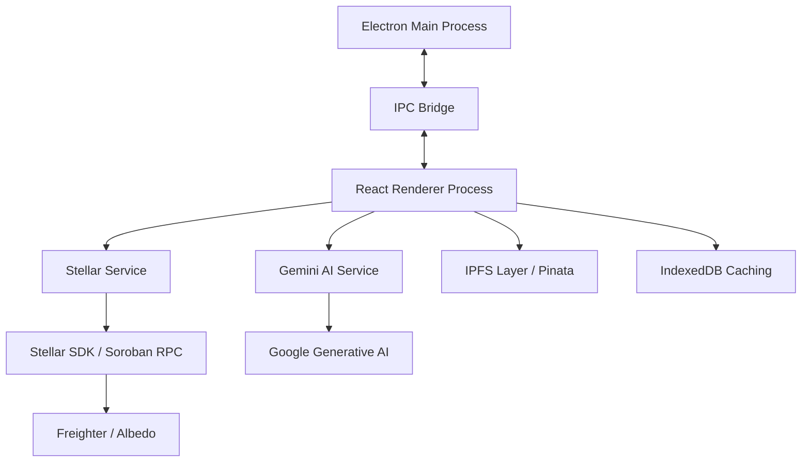

<div align="center">

# 🌐 SOCIALFLOW

### The Professional Nexus for Social Media Management & Web3 Promoting

**Engineering the future of decentralized creator economies with Gemini AI and Stellar.**

*Last updated: February 24, 2026*

[](https://stellar.org)
[](https://deepmind.google/technologies/gemini/)
[](https://www.electronjs.org/)
[](LICENSE)

[Exploration Guide](#-exploration-guide) • [Architecture](#-system-architecture) • [Roadmap](#-strategic-roadmap) • [Contributors](#-developer-ecosystem)

</div>

---

## 💎 The SocialFlow Paradigm

SocialFlow is a state-of-the-art **social media management and promoting application** designed to restore sovereignty to digital creators. By converging Large Language Models (LLMs) with Decentralized Ledger Technology (DLT), we provide a suite of management, orchestration, and economic primitives that are transparent, non-custodial, and hyper-automated.

### 🌐 Strategic Value Propositions

* **Cognitive Automation**: Leveraging Gemini 1.5/2.5 Pro for high-fidelity content synthesis and community sentiment alignment.
* **Economic Sovereignty**: Direct implementation of the Stellar network for instantaneous, sub-cent settlement of tips, rewards, and asset transfers.
* **Verifiable Influence**: Transitioning social metrics from proprietary database entries to immutable on-chain attestations via Soroban smart contracts.

---

## 🚀 Architectural Pillars

### 🤖 1. Synergetic AI Suite

Our intelligence layer transcends simple generation, providing a sophisticated creative workflow:

* **Predictive Copywriting**: Multi-platform caption synthesis optimized for specific engagement KPIs (TikTok, IG, X, LinkedIn).
* **Intelligent Response Protocol**: Automated sentiment analysis and professional-grade reply generation to maintain 24/7 community presence.
* **Media Optimization**: AI-driven suggestions for hashtags and visual positioning to maximize algorithmic reach.

### ⛓️ 2. Decentralized Economic Primitives (Stellar)

We utilize the Stellar Network to build deep financial integration into the social workflow:

* **Non-Custodial Integrity**: Direct integration with **Freighter** and **Albedo**. SocialFlow serves as a secure gateway, never accessing private keys or sensitive signing material.
* **Asset Minting Engine**: Deploy fixed or inflationary brand tokens in seconds. Manage supply, distribution logic, and trustlines directly within the dashboard.
* **Programmable NFTs**: Bridge creative content to the blockchain with IPFS-anchored metadata and on-chain provenance tracking.
* **Unified Settlement**: Multi-asset support (XLM, USDC, Custom Assets) for global, near-instant content monetization.

### 📑 3. Soroban-Powered Smart Campaigns

Move beyond manual rewards to code-enforced growth:

* **Automated Engagement Distribution**: Smart contracts that autonomously reward verifiable community engagement.
* **Budgeting Treasuries**: Securely lock promotion budgets in transition-verified on-chain accounts, releasing funds only upon milestone completion.
* **Public Verification**: Generate cryptographic proof of post-performance, allowing for transparent 3rd-party audits.

---

## 🛠️ System Architecture

SocialFlow is architected as a robust, secure **Electron Desktop Application**, providing local-first data integrity for blockchain operations.



---

## 🗺️ Strategic Roadmap & Milestones

The SocialFlow evolution is meticulously categorized into functional modules:

| Milestone | Title | Strategic Focus | Technical Deliverables |
| :--- | :--- | :--- | :--- |
| **P1** | **Foundation** | Core Protocol Bridge | Wallet APIs, Horizon Bridge, IPC Security Protocol |
| **P2** | **Identity** | Decentralized Sovereign Identity | DIDs, Cryptographic Attestations, Social Linking |
| **P3** | **Liquidity** | Economic Primitives | Asset Minting, Batch Trustlines, Path Payments |
| **P4** | **Collectibles** | Content Bridge | IPFS Integration, NFT Minter, Metadata Standards |
| **P5** | **Automation** | Smart Campaign Logic | Soroban Integration, Reward Automation, Treasuries |
| **P6** | **Intelligence** | Performance & Audit | Desktop Push, Real-time RPC Streaming, Audit Export |

---

## 👩‍💻 Developer Ecosystem

SocialFlow is built by a community of high-level contributors. We utilize a **Modular Issue System** to ensure parallel development of decoupled features.

* **Engineering Tasks**: Detailed granular issues are documented in [.kiro/specs/stellar-web3-integration/tasks.md](.kiro/specs/stellar-web3-integration/tasks.md).
* **Implementation Strategy**: Architecture decisions are outlined in [.kiro/specs/stellar-web3-integration/implementation_plan.md](.kiro/specs/stellar-web3-integration/implementation_plan.md).

### Deployment Environment

```bash
# Clone and Initialize
git clone https://github.com/your-org/socialflow.git
cd socialflow && npm install

# Provision Environment
# Create .env.local with API_KEY and PINATA_SECRETS

# Launch Development Environment
npm run electron:dev
```

---

<div align="center">
  <p><strong>Redefining the digital creator economy through decentralized engineering.</strong></p>
  <p>Built by SocialFlow Labs & The Stellar Global Community</p>
</div>
